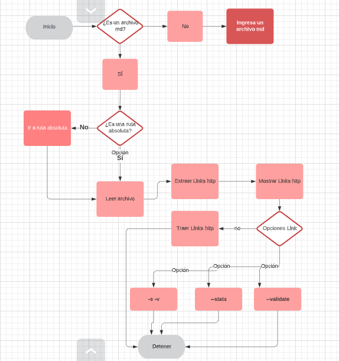

# Markdown Links :computer:

### 1. Preámbulo

Markdown es un lenguaje de marcado que facilita la aplicación de formato a un texto empleando una serie de caracteres de una forma especial. En principio, fue pensado para elaborar textos cuyo destino iba a ser la web con más rapidez y sencillez que si estuviésemos empleando directamente HTML. Y si bien ese suele ser el mejor uso que podemos darle, también podemos emplearlo para cualquier tipo de texto, independientemente de cual vaya a ser su destino.

Los archivos Markdown normalmente contienen links (vínculos/ligas) que muchas veces están rotos o ya no son válidos y eso perjudica mucho el valor de la información que se quiere compartir.

Esta librería se encargar de leer y analizar los archivos en formato Markdown, para verificar los links que contengan y reportar algunas estadísticas como ver los links totales, los únicos y los que estan rotos.

## 3. Resumen de proyecto
La lógica de este programa la podemos observar en el diagrama a continuación:

## 4. Diagrama de flujo

## 5. Instalacion

Para instalar la librería ingresa el siguiente comando en tu consola:

`npm i md-link-garrido-garcia`

Después agrega la siguiente línea en el archivo que contendrá las funciones de lectura de los documentos:

`const mdLinkGarridoGarcia = require("md-link-garrido-garcia")`

## 6. Modo de Uso

Para hacer uso de la librería primero debes ejecutar el siguiente comando en la terminal de tu archivo, entregando la ruta de tu archivo.

`$ node \path\ md-links`

Para ver el total de links y total de links únicos ejecuta el siguiente comando en la terminal.

`$ node \path\ -validate o -v`

Tus consola se verá así:

**Mostrará el status 200 y 404.**

**200**: La solicitud ha tenido éxito.

**404**: NOT FOUND. El servidor no pudo encontrar el contenido solicitado.

## 7. Autoras

Maria Jose Garrido y Dalia Garcia

